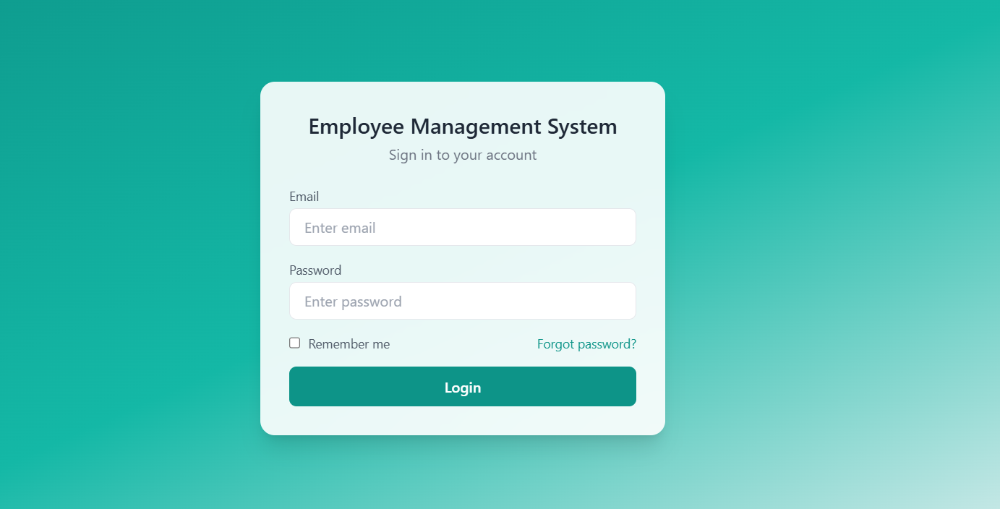
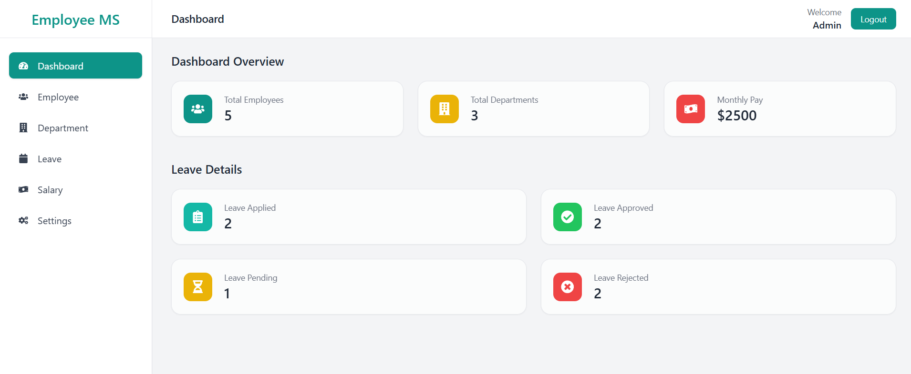
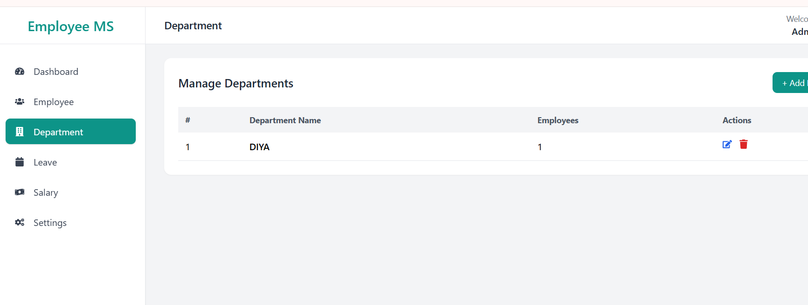

<h1 align="center">Employee Management System</h1>

<p align="center">
A full-stack MERN application for managing employees, departments, and administrative operations.
</p>

<p align="center">
🚧 Status: Work in Progress
</p>

<p align="center">


</p>

---

## Overview

The **Employee Management System** is a full-stack web application built using the **MERN stack (MongoDB, Express, React, Node.js)**.

It allows administrators to manage employees, departments, and organizational data through a centralized dashboard.

This project is currently under development as part of my learning journey in full-stack development.

---

## Features

- User Authentication
- Admin Dashboard
- Department Management
- Secure Backend API
- Middleware-based Authorization

---

## Planned Features

- Employee Dashboard
- Employee CRUD Operations
- Leave Management System
- Role-Based Access Control
- Search and Filtering

---

## Tech Stack

### Frontend

- React
- Vite
- Tailwind CSS

### Backend

- Node.js
- Express.js
- MongoDB
- JWT Authentication

---

## Project Structure

```
employee-management-system
│
├── server
│   ├── controllers
│   ├── middleware
│   ├── models
│   ├── routes
│   ├── db
│   ├── index.js
│   └── package.json
│
├── frontend
│   ├── public
│   ├── src
│   │   ├── assets
│   │   ├── components
│   │   ├── context
│   │   ├── pages
│   │   ├── utils
│   │   ├── App.jsx
│   │   └── main.jsx
│   │
│   ├── index.html
│   └── package.json
│
└── README.md
```

---

## Installation

Clone the repository

```
git clone https://github.com/Diyapareta/employee-management-system.git
```

### Backend Setup

```
cd backend
npm install
npm start
```

### Frontend Setup

```
cd frontend
npm install
npm run dev
```

---

## Environment Variables

Create a `.env` file inside the backend folder.

```
MONGO_URI=your_mongodb_connection
JWT_SECRET=your_secret_key
```

---

## Current UI Screens

Below are some screens that are currently implemented.

### Login Page



### Admin Dashboard



### Department Management



---

## Acknowledgements

This project was built while learning the **MERN stack** and following online tutorials.  
I am extending it with additional features and improvements.

---

## Future Improvements

- Employee Dashboard
- Attendance Tracking
- Leave Management
- Admin Analytics
- UI Enhancements
